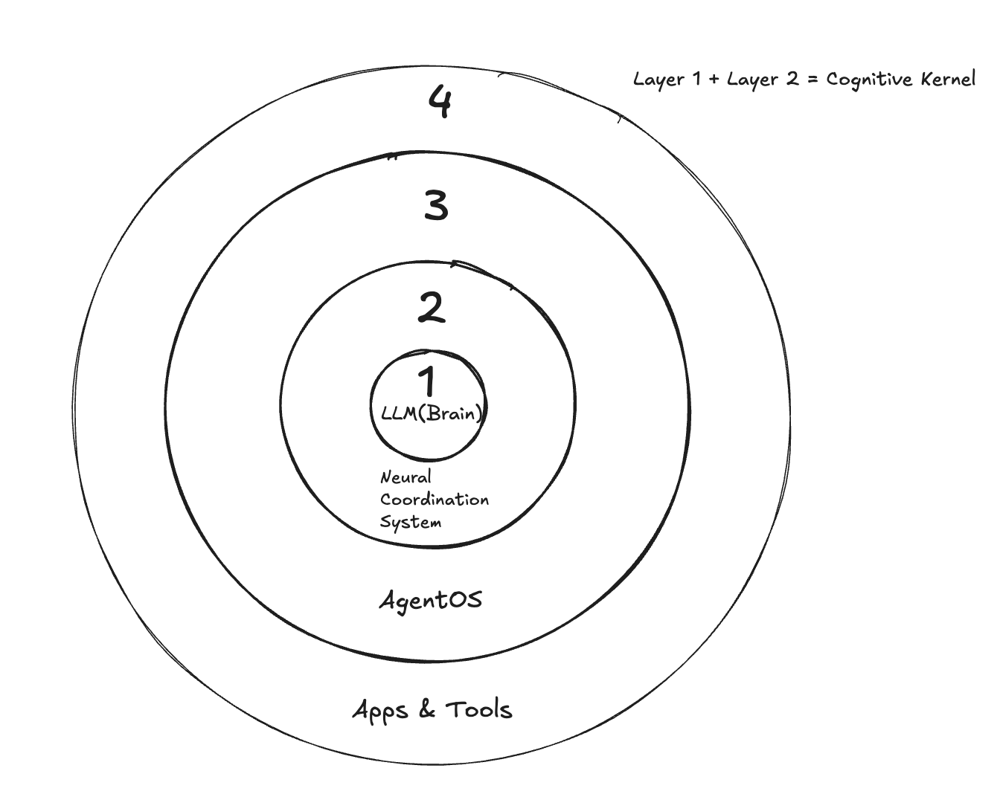
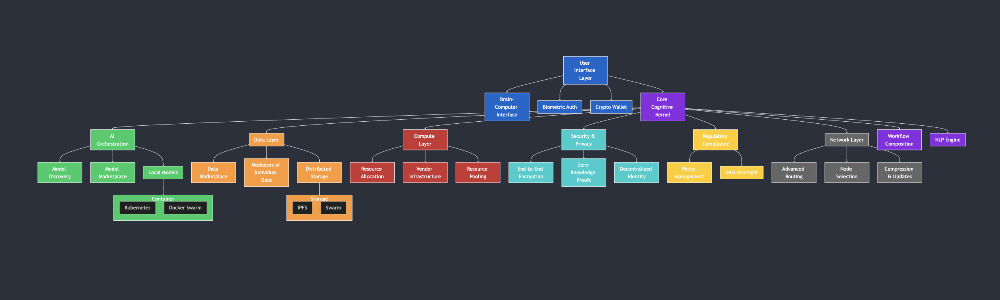

# Mindport Terminal: A Universal Bridge to Human-AI Convergence

This work is licensed under a [Creative Commons Attribution-ShareAlike 4.0 International License](http://creativecommons.org/licenses/by-sa/4.0/).

Kyle Daniel Collins  
mindport@tutamail.com  
February 18, 2025

### Abstract

The artificial intelligence landscape has become increasingly fragmented across centralized platforms and isolated services, creating barriers to innovation and limiting humanity's ability to harness AI's full potential. As we approach the convergence of human and artificial intelligence, this fragmentation threatens not just technological progress, but the very sovereignty of human-AI interaction.

We present Mindport Terminal, a transformative cognitive interface that fundamentally reshapes human-AI interaction. At its core lies the cognitive kernel—an intelligent nervous system that orchestrates AI models into a unified, living ecosystem. Through sophisticated neural coordination, individual AI models transcend their original capabilities, achieving collective intelligence that adapts and evolves to meet human needs. Like science fiction's vision of JARVIS from Iron Man—an AI that seamlessly enhances human capability—Mindport creates truly intelligent systems that function as natural extensions of human thought and intention, but grounds this vision in real, practical technology.

Through sophisticated neural coordination, privacy-preserving computation, and spatial interfaces, Mindport enables intuitive discovery and composition of AI services via natural language and thought. This groundbreaking architecture preserves human sovereignty while unlocking unprecedented capabilities, ensuring that as we progress toward direct neural integration, individuals and communities—not corporations—maintain control over their digital existence.

Mindport redefines the economics of AI through Community-Backed AI Training and Mediators of Individual Data (MIDs), creating an ecosystem where communities can marshal computational resources rivaling traditional tech giants. By implementing privacy-preserving computation and data dignity frameworks, the platform ensures that the value generated from AI development and personal data flows back to those who create it.

As brain-computer interfaces evolve from science fiction to reality, Mindport's cognitive kernel—which learns and adapts like the human nervous system—provides an immediate bridge between current technology and future neural integration. Through dynamic holographic workspaces that transform physical space into computational environments, the platform enables fluid transitions between traditional interfaces, spatial computing, and direct neural interaction. This isn't just a technical solution to AI fragmentation—it's a comprehensive framework ensuring that humanity's inevitable merger with technology occurs on human terms, preserving our dignity, privacy, and freedom to shape our own cognitive evolution.

### Inspirations and Influences

Mindport Terminal draws inspiration from a diverse array of visionary sources that blend technology with human potential:

- **Cinematic and Cultural Inspirations:**

  - **Jarvis from Iron Man:** An intelligent, seamlessly integrated AI assistant that enhances human capabilities.
  - **Cyberpunk (Video Game):** Immersive digital landscapes where decentralized, futuristic technologies empower individuals.
  - **The Matrix:** The iconic concept of downloading knowledge and skills directly into the human brain — exemplified by Neo's rapid kung fu training.

- **Technical Inspirations:**
  - Our approach is also informed by pioneering platforms such as the [Postman AI Agent Builder](https://www.postman.com/product/ai-agent-builder/) and [LangChain](https://www.langchain.com/), which demonstrate the potential of natural language API discovery and dynamic, modular workflow composition.

These collective inspirations shape our vision for a decentralized, vendor-agnostic AI orchestration ecosystem that not only harnesses advanced technical capabilities but also embraces a futuristic, user-empowered approach to innovation.

## 1. Introduction

Artificial Intelligence services on the Internet have come to rely almost exclusively on centralized platforms and fragmented ecosystems, creating barriers to entry and limiting synergistic advancements. While these systems work for specialized tasks, they suffer from inherent weaknesses of the siloed model. Users struggled to discover and compose AI capabilities across different providers, and seamless integration remains a challenge due to vendor lock-in and incompatible interfaces. The cost of navigating multiple platforms, APIs, and subscription models increases usage complexity, limiting widespread adoption and cutting off the possibility for truly universal AI interfacing.

With this fragmentation, technical barriers multiply. Users must navigate inconsistent experiences and complex integration challenges they would otherwise avoid. Developers struggled to compete with tech giants, accepting limited access to advanced models as unavoidable. These inefficiencies and innovation barriers can be mitigated in large organizations by using proprietary ecosystems, but no mechanism exists to provide universal AI access and development capabilities without centralized control.

### 1.1 Beyond Integration: The Natural Language Orchestration Approach

Current solutions to AI fragmentation focus primarily on connecting different AI services through complex technical integrations. However, mere connection falls short of unlocking AI's true potential. What's needed is a natural language-driven system that enables users to discover, compose, and orchestrate AI services intuitively – similar to how we might instruct a human assistant.

Consider how a simple task like "create a business proposal" is handled differently:

- Traditional Integration:

  - Requires manual configuration of different AI tools
  - Forces users to understand technical APIs and interfaces
  - Locks users into specific vendor implementations

- Natural Language Orchestration:
  - Users express needs in plain language (e.g., "find a low-latency image generation service")
  - System dynamically discovers and composes appropriate AI services
  - Vendor-agnostic approach allows automatic selection of optimal providers
  - Supports both cloud-based and local AI model integration

### 1.2 The Mindport Terminal Solution

We propose a revolutionary solution to the AI fragmentation problem using a decentralized, vendor-agnostic platform that implements natural language orchestration for AI systems. We call it: Mindport Terminal. At its core is the cognitive kernel - not just another integration layer, but a sophisticated coordination system that enhances and orchestrates AI models through intuitive natural language interfaces, turning basic AI services into JARVIS-like experiences.

Unlike traditional platforms that simply connect AI services, Mindport Terminal's cognitive kernel:

- Enables natural language discovery and composition of AI workflows
- Maintains vendor-agnostic abstractions for compute, storage, and data exchange
- Supports integration of local AI models for enhanced privacy and control
- Implements modular regulatory frameworks for flexible compliance
- Preserves user sovereignty over data and interactions

The system remains open-source, free to download, and community-driven, collectively fostering innovation more effectively than any centralized group of AI providers. This approach not only solves the fragmentation problem but elevates the capabilities of every AI model it coordinates.

### 1.3 A New Paradigm for AI Interaction

This natural language orchestration approach represents a fundamental shift in how we think about AI systems:

```
Traditional Approach:
User → Technical API Integration → Vendor-Specific Services → Limited Outcomes

Mindport's Orchestration:
User → Natural Language Interface → Vendor-Agnostic Coordination → Enhanced Outcomes
         ↳ Dynamic API Discovery
         ↳ Workflow Composition
         ↳ Local Model Integration
         ↳ Regulatory Compliance
```

As we move toward more sophisticated AI interactions and eventual brain-computer interfaces, this intuitive, vendor-agnostic coordination becomes not just beneficial but essential. The following sections detail how Mindport Terminal implements this vision through its core components, marketplace mechanics, and advanced features.

### 1.4 User Sovereignty and Regulatory Philosophy

Central to Mindport Terminal's design is the principle of user sovereignty. While the platform provides comprehensive tools for regulatory compliance, it fundamentally respects users' right to choose their level of regulatory engagement. This philosophy acknowledges that innovation often occurs at the edges of regulatory frameworks, and that different jurisdictions and use cases require different levels of compliance. By making regulatory compliance modular and opt-in, Mindport Terminal enables both fully compliant enterprise deployments and unrestricted experimental implementations, allowing users to make informed decisions about their regulatory posture while maintaining access to the platform's core capabilities.

## 2. Core Components of the AI Terminal



_Figure 1: High-level architecture of Mindport Terminal showing key system components and their relationships_

### 2.1 Universal AI Interface and Orchestration Engine

At the heart of Mindport Terminal lies its orchestration engine, a sophisticated system that serves as the central hub for all AI interactions and operations within the platform. This engine functions as an intelligent coordination system, providing an adaptive layer that discovers, enhances, and orchestrates AI models and services through natural language interfaces.

The orchestration engine implements a multi-layered architecture designed to facilitate seamless AI service discovery and composition. The natural language discovery layer forms the foundation, employing sophisticated NLP techniques to understand and interpret user requirements. This layer maintains a dynamic registry of available services and their capabilities, enabling automated matching of user needs with appropriate AI resources. Through semantic analysis and context understanding, the system can effectively translate natural language queries into precise service requirements.

Above the discovery layer sits the workflow composition layer, which handles the intelligent assembly and optimization of AI workflows. This layer manages the complex task of orchestrating services across multiple providers while maintaining state and preserving context throughout execution. The system implements sophisticated resource allocation algorithms to ensure optimal performance and efficiency, dynamically adjusting workflow execution based on real-time performance metrics and resource availability.

The service abstraction layer completes the architecture by providing vendor-agnostic interfaces that standardize interaction with diverse AI services. This layer implements protocol standardization and adaptation mechanisms, enabling seamless integration of new services while maintaining consistent performance monitoring and optimization capabilities. The abstraction layer also handles service health monitoring and failover, ensuring robust and reliable operation across the platform.

The engine's adaptive architecture continuously adjusts its operations based on multiple factors, including current user requirements, available computational resources, service performance metrics, regulatory compliance requirements, and privacy parameters. This dynamic adaptation ensures optimal performance while maintaining compliance with user-defined constraints and system requirements.



_Figure 2: Detailed view of Mindport Terminal's cognitive kernel layers and their integration_

#### 2.1.2 Enhanced Context Integration via Model Context Protocol (MCP)

To further empower the orchestration engine, Mindport Terminal integrates the Model Context Protocol (MCP) as a standardized mechanism for retrieving contextual data. By leveraging MCP, the cognitive kernel can dynamically connect to diverse external data sources—ranging from enterprise applications to decentralized data repositories—ensuring that every AI interaction is informed by up-to-date and comprehensive context.

This integration extends the platform's vendor-agnostic approach beyond mere AI service coordination, enabling seamless, plug-and-play connectivity for contextual information. In doing so, it bolsters the system's natural language understanding and workflow composition capabilities without requiring bespoke API connectors for every data source.

For more details on MCP, please refer to [Anthropic's announcement](https://www.anthropic.com/news/model-context-protocol).

#### 2.1.3 Agent Scaling and Operational Effectiveness

The cognitive kernel's primary innovation lies in its capacity to transcend traditional operational constraints in AI agent deployment and execution. While conventional platforms focus on discrete task execution or basic service composition, Mindport implements a sophisticated neural coordination framework that enables unprecedented agent scalability and effectiveness.

The system achieves this through several key mechanisms:

**Dynamic Capability Enhancement**
The cognitive kernel implements an adaptive learning architecture that enables agents to enhance their operational capabilities through neural coordination. This framework facilitates:

- Recursive improvement through multi-agent interaction patterns
- Capability synthesis across heterogeneous agent systems
- Dynamic adaptation of operational parameters based on contextual feedback
- Progressive enhancement of agent decision-making processes

**Distributed Cognitive Architecture**
Through implementation of a distributed cognitive architecture, agents can:

- Leverage collective computational resources across the network
- Maintain operational coherence during complex multi-stage tasks
- Scale processing capacity dynamically based on task requirements
- Preserve context and state across distributed operations

**Autonomous Operational Scaling**
The system implements sophisticated scaling mechanisms that enable agents to:

- Expand their operational scope while maintaining execution efficiency
- Adapt to increasing task complexity through dynamic resource allocation
- Preserve alignment with human intent during capability enhancement
- Optimize resource utilization across distributed agent networks

**Cross-Agent Learning Protocols**
The cognitive kernel facilitates advanced learning through:

- Standardized protocols for capability transfer between agents
- Distributed knowledge synthesis across agent populations
- Real-time adaptation based on collective operational experience
- Maintenance of operational integrity during capability expansion

This architecture represents a fundamental advancement in agent operational effectiveness. Rather than simply increasing computational capacity, the system enables qualitative improvements in agent capabilities while maintaining robust operational coherence. Through sophisticated resource allocation algorithms and capability enhancement protocols, agents can evolve from handling discrete tasks to managing complex, multi-stage operations with increasing autonomy and effectiveness.

The cognitive kernel thus functions as a force multiplier, enabling each agent to leverage the collective capabilities of the ecosystem while maintaining strict alignment with human-defined objectives. This approach transcends traditional scaling limitations, creating a framework where agent capabilities can grow systematically while preserving operational integrity and human oversight.

### 2.2 Vendor-Agnostic Infrastructure

Unlike traditional AI platforms that rely on specific service providers, Mindport Terminal implements a comprehensive vendor-agnostic architecture that ensures flexibility and sovereignty over computational resources. This infrastructure is built on three fundamental pillars: compute abstraction, storage abstraction, and data exchange.

The compute abstraction layer enables dynamic selection and optimization of computational resources across multiple providers. Through sophisticated workload distribution algorithms, the system can efficiently allocate tasks while maintaining performance objectives and cost constraints. This layer implements continuous monitoring and optimization of resource usage, ensuring efficient utilization while maintaining the flexibility to adapt to changing requirements.

Storage abstraction provides a unified interface for distributed data management across diverse storage providers. The system implements standardized protocols for data replication and redundancy, ensuring data availability and durability while maintaining privacy and security requirements. Content-addressed storage interfaces enable efficient data retrieval and management, while privacy-preserving mechanisms ensure data sovereignty and compliance with security requirements.

The data exchange layer completes the infrastructure by providing standardized protocols for secure and efficient data transfer between system components. This layer implements comprehensive interoperability mechanisms, enabling seamless communication across different providers while maintaining audit trails and compliance records. Through these standardized interfaces, organizations can maintain sovereignty over their data while leveraging the benefits of distributed systems.

### 2.2.1 Containerized Agentic AI Deployments

To further reinforce our commitment to a vendor-agnostic and scalable architecture, Mindport Terminal employs containerization for agentic AI deployments. By encapsulating each autonomous AI agent—along with its runtime environment, dependencies, and configurations—within lightweight containers, we ensure that the system remains isolated, secure, and fully portable across diverse deployment environments.

**Key Benefits:**

- **Isolation and Security:**  
  Each AI agent operates within its own container, effectively sandboxing processes and libraries. This isolation prevents unintended interactions between agents, minimizes resource conflicts, and enforces strict security boundaries.

- **Portability and Reproducibility:**  
  Container images encapsulate the entire operating environment. This guarantees that an agent behaves consistently from development to testing and production, regardless of the underlying infrastructure—be it on-premises, in the cloud, or in a hybrid setup.

- **Scalability and Dynamic Orchestration:**  
  Utilizing orchestration platforms like Kubernetes or Docker Swarm, Mindport Terminal can dynamically scale containerized agents. This automatic workload distribution not only optimizes resource allocation but also supports rapid scaling in response to real-time demand.

- **Streamlined Updates and Maintenance:**  
  The modularity inherent in containerization simplifies ongoing updates and maintenance. With continuous integration and delivery workflows, individual containers can be updated or replaced without impacting the overall system stability or compromising compliance.

- **Enhanced Compliance and Monitoring:**  
  Containers facilitate precise resource monitoring and policy enforcement. Integrated logging and security instrumentation ensure that autonomous operations within each container comply with regulatory, ethical, and operational standards.

By leveraging containerized deployments, Mindport Terminal not only achieves robust, scalable, and secure agentic AI operations but also lays the groundwork for seamless integration within a decentralized, vendor-agnostic ecosystem.

### 2.3 Local Model Integration Framework

A key innovation in Mindport Terminal is its sophisticated framework for integrating local AI models, enabling organizations to maintain control over sensitive computations while participating in the broader ecosystem. This framework represents a significant advancement in hybrid AI deployment architectures, combining the security benefits of local computation with the scalability of distributed systems.

The model deployment infrastructure provides a robust foundation for local AI integration, implementing hardware-optimized runtime environments that maximize computational efficiency. Through sophisticated resource management algorithms, the system automatically scales and optimizes model deployment based on available hardware capabilities and workload requirements. The infrastructure maintains comprehensive version control and deployment management, ensuring consistency and reliability while enabling rapid iteration and improvement of local models.

The integration protocols establish standardized interfaces for model interaction, abstracting the complexity of different runtime environments and enabling seamless communication between local and distributed components. These protocols implement sophisticated state management mechanisms that maintain computational context across execution environments, ensuring consistent behavior and optimal performance. Through careful abstraction of runtime-specific details, the protocols enable portable model deployments that can adapt to diverse hardware configurations while maintaining consistent interfaces.

The hybrid execution environment represents perhaps the most sophisticated aspect of the framework, implementing intelligent workload distribution mechanisms that optimize resource utilization across local and distributed compute resources. This environment employs advanced privacy-preserving computation routing, ensuring sensitive operations remain within appropriate security boundaries while enabling efficient resource utilization. Through continuous monitoring and adaptation, the system maintains optimal performance while adhering to organizational security and privacy requirements.

### 2.4 Regulatory Compliance Framework

To address the complex regulatory landscape of AI deployment, Mindport Terminal implements a modular compliance framework that enables dynamic adaptation to various regulatory requirements. Crucially, this framework operates on an opt-in basis, recognizing that regulatory compliance requirements vary significantly across jurisdictions, use cases, and individual preferences. This approach acknowledges the fundamental principle of user sovereignty while providing robust compliance tools for those who require them.

The policy engine forms the core of the compliance framework, implementing a sophisticated module system that enables dynamic loading and enforcement of regulatory requirements. Users and organizations can selectively activate specific compliance modules based on their jurisdictional requirements or operational preferences. This granular control enables organizations to implement jurisdiction-specific requirements while maintaining consistent interfaces and behavior, without imposing restrictions on users operating in different regulatory contexts.

Compliance orchestration mechanisms manage the complex task of resolving potentially conflicting requirements across different jurisdictions, but only for those compliance modules explicitly enabled by the user. Through sophisticated policy resolution algorithms, the system determines appropriate enforcement actions while maintaining consistency with selected regulations. The orchestration layer implements automated verification of compliance states for activated modules, ensuring adherence to chosen regulatory requirements while minimizing operational overhead.

The verification infrastructure provides comprehensive mechanisms for validating compliance enforcement and generating required regulatory documentation for enabled compliance modules. Through automated compliance checking and continuous monitoring, the system maintains detailed records of enforcement actions and outcomes only for activated compliance features. This infrastructure implements sophisticated reporting automation, enabling organizations to demonstrate compliance with their chosen regulatory frameworks while minimizing manual intervention.

This modular and opt-in approach to regulatory compliance represents a significant advancement over traditional fixed compliance implementations. By enabling dynamic adaptation to changing regulatory requirements while preserving user choice, the framework ensures organizations can maintain necessary compliance without imposing unnecessary restrictions on users operating under different regulatory contexts. The careful separation of policy definition from enforcement mechanisms, combined with granular user control, enables a flexible system that respects both regulatory requirements and individual sovereignty.

Through these four core components—the orchestration engine, vendor-agnostic infrastructure, local model integration framework, and regulatory compliance framework—Mindport Terminal establishes a comprehensive foundation for next-generation AI deployment. This architecture enables organizations to maintain sovereignty over their AI resources while leveraging the benefits of distributed systems, all within a framework that ensures regulatory compliance and operational efficiency.

## 3. Decentralized AI and Data Marketplace

### 3.1 AI Model Exchange and Enhancement Marketplace

The AI Model Exchange represents more than just a marketplace for AI models - it's a sophisticated platform where models can be discovered, evaluated, and enhanced through the cognitive kernel's neural coordination capabilities. This exchange creates an environment where AI models become more valuable through their potential for enhancement and orchestration within the Mindport ecosystem.

The exchange evaluates and categorizes models not just by their base capabilities, but by their potential for enhancement through neural coordination. Through sophisticated evaluation protocols, the system assesses models based on their coordination compatibility, state management capacity, and potential for integration within complex workflows. This approach ensures that models are valued not just for their standalone capabilities, but for their potential within orchestrated systems.

The exchange's distribution mechanism builds upon the core infrastructure layers discussed in Section 2, implementing sophisticated protocols for model discovery, deployment, and enhancement. Unlike traditional model marketplaces that simply store and serve models, Mindport's exchange actively enhances models through integration with the cognitive kernel. This enhancement process enables models to participate in complex workflows, maintain persistent context, and leverage the collective capabilities of the ecosystem.

Beyond traditional model evaluation, the exchange implements testing protocols that assess how models perform under neural coordination. These protocols measure coordination response, context utilization, and cross-model synergy, providing developers and users with comprehensive insights into model capabilities within orchestrated environments. This sophisticated evaluation framework ensures that models can be effectively matched with use cases that leverage their enhanced capabilities.

### 3.2 Data Marketplace, Tokenization, and MIDs

In an era where artificial intelligence generates unprecedented volumes of personal data through human-AI interactions, the question of data ownership and dignity becomes paramount. Building on pioneering research in data dignity, Mindport Terminal implements a data marketplace that fundamentally reimagines the relationship between individuals and their data. This system recognizes that people should have moral and economic rights to any data that exists because they exist – including the vast streams of interaction data generated through AI assistance.

At the core of this marketplace lies the concept of Mediators of Individual Data (MIDs), organizations that bridge the gap between individual data rights and market mechanisms. MIDs serve as advocates and technical intermediaries, managing the complexity of data rights while ensuring fair compensation for data creators. These entities, which can range from small cooperatives to larger institutions, establish their own terms and membership criteria while operating within a framework that prioritizes individual data dignity.

The technical implementation leverages distributed storage solutions, such as those demonstrated by [Swarm Protocol](https://www.ethswarm.org/) and [IPFS](https://ipfs.io/), providing redundant and censorship-resistant data persistence. Through content-addressed storage protocols, the system ensures data availability and integrity while maintaining user sovereignty over their information. These storage solutions exemplify the potential for decentralized data management, though Mindport Terminal's modular architecture remains adaptable to various storage implementations.

The marketplace infrastructure implements sophisticated access control mechanisms and tokenization frameworks, drawing inspiration from projects like [Ocean Protocol](https://oceanprotocol.com/) in demonstrating the potential for decentralized data economies. Through granular access management at the fundamental data level, the system enables customized token-gating mechanisms that can be adapted to specific use cases and privacy requirements. This infrastructure ensures that as AI systems become more sophisticated and generate increasingly detailed personal interaction data, individuals retain ownership and control over their digital footprint.

The system's modular design allows for integration of various distributed storage solutions and data marketplace protocols, ensuring that organizations can select or transition between different implementations while maintaining consistent data sovereignty principles. This flexibility enables the platform to evolve alongside advancing storage technologies and marketplace mechanisms while preserving its core commitment to user data rights.

### 3.3 Computational Resource Sharing

The democratization of AI development requires massive computational resources, traditionally available only to large tech corporations. Mindport Terminal revolutionizes this paradigm through a sophisticated computational fabric that enables community-driven resource sharing and allocation. This infrastructure supports diverse computational workloads through its API framework, allowing for parallel processing of complex AI tasks while maintaining cost efficiency through intelligent resource allocation and scheduling.

What distinguishes Mindport Terminal's approach is its transformation of computational infrastructure into a community-driven resource. Through the platform, communities can aggregate their computational resources and financial capital toward collective AI initiatives. This Community-Backed AI Training (CBAT) framework enables groups to marshal computational power that rivals traditional tech giants, while maintaining democratic control over the development process.

The system extends collaborative model development paradigms into the realm of decentralized compute, enabling communities to leverage established training pipelines and optimization techniques while utilizing distributed compute resources. This enables efficient fine-tuning of foundation models, training of specialized models, and implementation of novel architectures using battle-tested training frameworks, all through the Mindport interface.

Through these marketplace mechanisms, Mindport Terminal creates an ecosystem where the economic value generated from AI development and data usage flows back to the individuals and communities that generate it. This represents a fundamental shift away from centralized control of AI resources, moving toward a future where communities can meaningfully participate in and benefit from the AI-driven economy while maintaining sovereignty over their resources and data.

#### Hashrate Donation for AI Development Funding

A revolutionary feature of Mindport Terminal's computational fabric is its implementation of cryptocurrency mining as a direct funding mechanism for AI development. Users can opt to donate their hashrate to self-hosted mining pools, creating a novel fundraising approach for AI initiatives. This mechanism draws inspiration from successful implementations in the Bitcoin ecosystem, where similar approaches have demonstrated the ability to raise significant capital through community-coordinated mining efforts.

The system implements sophisticated pool management protocols that enable temporary or permanent hashrate donation campaigns. During these campaigns, participants can direct their computational resources to a self-hosted pool running on minimal infrastructure, with all mining rewards automatically allocated toward specific AI development goals. These could include:

- Training new open-source AI models
- Developing AI tooling and infrastructure
- Funding physical computing resources
- Supporting community-driven AI research
- Maintaining critical AI development tools

The self-hosted pool infrastructure is designed for simplicity and transparency, allowing communities to verify the distribution of mining rewards and track funding allocation in real-time. Through democratic governance mechanisms, communities can collectively decide which AI initiatives receive funding, creating a sustainable source of capital for projects that might otherwise struggle to secure traditional funding.

This mining-based funding mechanism integrates seamlessly with the platform's Community-Backed AI Training (CBAT) framework, enabling communities to combine direct computational resources for AI training with mining-generated financial resources. The result is a comprehensive resource allocation system that maximizes the community's ability to support AI development through both direct computation and financial contribution.

## 4. Development, Customization, and Advanced Features

### 4.1 Development Tool Integration and Neural Coordination Extension

Much like how Tony Stark's JARVIS serves as a nervous system coordinating his various tools and technologies, Mindport Terminal's cognitive kernel doesn't just integrate with development tools - it enhances and orchestrates them through intelligent neural coordination. Instead of creating another integrated development environment, the system provides developers with the capability to extend and enhance their existing tools through neural coordination.

The cognitive kernel transforms traditional development tools through intelligent coordination. When teams collaborate on projects, the cognitive kernel doesn't just track activities - it enhances the entire development process through context-aware resource allocation, intelligent agent assignment, and workflow optimization. The system maintains and synthesizes project knowledge across teams while learning and enhancing development patterns over time.

Rather than replacing current tools, the cognitive kernel enhances them through IDE plugins, CLI tools, API extensions, and SDKs for coordination pattern development. This approach ensures that developers can continue using their preferred tools while gaining enhanced capabilities through neural coordination. The extension framework enables developers to create new neural coordination patterns, develop specialized enhancement modules, and implement novel orchestration strategies.

The result is a development environment where tools become more powerful through neural coordination, while maintaining familiarity and existing workflows. This creates a foundation for continuous innovation in how AI capabilities are developed and enhanced, enabling teams to leverage the full potential of AI assistance while preserving their established development practices.

### 4.2 Customizable AI Clusters

The cognitive kernel's ability to enhance and coordinate AI models enables users to create Personal AI Clusters - sophisticated constellations of AI capabilities that work together seamlessly through neural coordination. This addresses the fundamental problem of AI fragmentation in a unique way: rather than simply connecting different AI tools, the cognitive kernel acts as an intelligent nervous system that amplifies and orchestrates their capabilities.

When users select their preferred AI models - whether it's GPT-4 for reasoning, Stable Diffusion for image creation, or specialized models from HuggingFace - the cognitive kernel doesn't just integrate them; it enhances their capabilities through intelligent coordination and context management. Like a nervous system coordinating different parts of a brain, the kernel amplifies model capabilities through intelligent routing and context preservation, manages complex workflows across multiple AI models, maintains persistent memory and learning across interactions, and adapts model behavior based on user patterns and preferences.

The cognitive kernel's enhancement of these AI clusters becomes increasingly sophisticated over time through learning optimal routing patterns, understanding user preferences, building complex workflow automations, and creating efficient resource utilization strategies. This approach fundamentally transforms how users interact with AI, creating a personal AI experience that adapts to each user's needs while maintaining simplicity of interaction.

### 4.3 Cross-Reality and Brain-Computer Interfacing

The evolution toward brain-computer interfaces isn't just a feature of Mindport Terminal - it's an inherent destination of its neural coordination architecture. The system's design anticipates the progression from traditional interfaces through augmented reality to direct neural connections, implementing an architecture that naturally evolves with advancing interaction technologies.

#### Spatial Computing and Dynamic Interfaces

The cognitive kernel implements sophisticated spatial awareness that enables users to manipulate AI interfaces as physical objects in their environment. Similar to Tony Stark's holographic workspace, users interact with a dynamic computational environment where interface elements can be projected into physical space through augmented and virtual reality. These projections behave as tangible objects, responding to natural hand gestures and spatial positioning while maintaining their computational functionality.

The system's spatial computing layer enables users to manipulate AI workflows and data visualizations with unprecedented fluidity, treating computational interfaces as physical objects that can be repositioned, expanded, and transformed within their environment. Complex data structures and AI processes can be expanded into three-dimensional representations, allowing for intuitive exploration and manipulation of sophisticated computational workflows. This spatial manipulation extends to persistent AI processes, which can be anchored to specific locations or devices, creating an ambient computing environment that adapts to user movement and context.

#### Cross-Device Orchestration

The cognitive kernel coordinates AI interactions across multiple devices and display surfaces, treating them as a unified spatial canvas. This orchestration layer enables seamless transition of interfaces between physical screens, holographic displays, and augmented reality environments while maintaining persistent state and workflow continuity. The system's spatial awareness allows for intuitive transfer of AI processes between devices, creating a fluid computing environment that adapts to user movement and interaction patterns.

This cross-device orchestration creates a continuous computational environment where AI processes and interfaces flow naturally between different visualization modalities. The system maintains spatial awareness across all connected devices, enabling collaborative workspaces where multiple users can interact with shared AI processes and visualizations. This creates an environment where computational resources become an extension of physical space, accessible through any available display surface while maintaining consistent interaction patterns and workflow state.

#### Neural Interface Evolution

The cognitive kernel's architecture mirrors the human nervous system's ability to coordinate across different types of inputs and outputs. As interaction paradigms evolve from traditional interfaces through spatial computing to neural interfaces, the system maintains consistent enhancement patterns while adapting to new modalities. This architectural approach ensures that Mindport Terminal can serve as a bridge between current interaction methods and future neural interfaces.

The system implements sophisticated privacy and security measures at every level, ensuring that as interfaces become more direct, user sovereignty remains protected. Through careful implementation of neural privacy protocols, thought protection mechanisms, and cognitive sovereignty frameworks, the system ensures that users maintain complete control over their interactions, regardless of the interface modality.

As brain-computer interfaces evolve from medical devices to consumer technology, Mindport's neural coordination architecture provides a natural framework for human-AI convergence. The system enables thought amplification through AI coordination, seamlessly integrating neural input with spatial interfaces while maintaining context awareness across different interaction modalities. This hybrid approach combines the intuitive nature of thought-based interaction with the tangible benefits of spatial computing, creating a fluid interface that adapts to user preferences and capabilities.

This architecture represents not just a technical solution for current AI interaction challenges, but a foundational framework for the future of human-AI convergence. By implementing sophisticated neural coordination mechanisms today, Mindport Terminal establishes the groundwork for seamless integration with emerging interface technologies while preserving user sovereignty and privacy.

## 5. Governance, Ethics, and Economic Model

### 5.1 Ethical AI and Decentralized Governance

Mindport Terminal approaches AI ethics and governance through a principle of enabled responsibility rather than enforced compliance. Like the development of the internet itself, attempting to mandate specific ethical frameworks would likely lead to fragmentation and the emergence of uncontrolled alternatives. Instead, Mindport provides a neutral platform with sophisticated tools for implementing and managing ethical frameworks based on community needs and preferences.

#### Community-Driven Policy Evolution

The platform implements a decentralized governance structure inspired by successful community-moderation systems like Twitter's Community Notes, but enhanced by AI capabilities. Communities participating in the Community-Backed AI Training (CBAT) framework can establish their own governance parameters, with the cognitive kernel managing compliance within those self-defined boundaries. This approach allows different communities to experiment with various governance models while maintaining interoperability through the broader Mindport ecosystem.

#### Modular Safety Implementation

Rather than enforcing a single set of safety standards, Mindport Terminal provides a modular architecture for implementing safety mechanisms. The interchangeable safety modules are a by-product of Constitutional AI. Coined by Anthropic, Constitutional AI is an innovative framework designed to align artificial intelligence systems with human values and ethical principles. This approach aims to ensure that AI models operate in a way that is helpful, harmless, and honest.

The cognitive kernel itself participates in the evolution of safety and governance mechanisms by analyzing potential impacts of proposed policies, identifying potential vulnerabilities or unintended consequences, suggesting improvements to safety modules based on observed behavior, and adapting governance mechanisms based on community feedback. This functionality is crucial for self-supervision.

While compliance remains optional, Mindport Terminal implements robust transparency mechanisms through public documentation of implemented safety measures, clear labeling of cognitive kernel modifications, and community-driven assessment of safety outcomes. This transparency enables users and communities to make informed decisions about which implementations they trust and wish to interact with, creating natural incentives for responsible development without requiring central enforcement.

### 5.2 Tokenomics and Incentive Structures

#### Established Cryptocurrency Integration

Rather than introducing a new token to the ecosystem, Mindport Terminal leverages truly decentralized cryptocurrencies to facilitate transactions and align incentives. Unlike stablecoins or platform-specific tokens that rely on centralized entities or dollar backing in traditional banks, ETH, BTC, and XMR operate on genuinely decentralized networks without single points of control or failure.

Ethereum (ETH) powers smart contract interactions for governance and automation, enables sophisticated token-gating mechanisms through ERC standards, facilitates complex economic arrangements through programmable contracts, and provides infrastructure for decentralized identity and reputation systems. Bitcoin (BTC) serves as a stable store of value for long-term community investments, enables secure, borderless payments for computational resources, and provides proven security for high-value transactions. Monero (XMR) offers privacy-preserving transactions when required, enables confidential payment for sensitive computational tasks, and protects user privacy in data marketplace transactions.

The deep liquidity of these cryptocurrencies enables automatic swapping into service-specific tokens when needed, allowing seamless conversion for accessing various computational resources while maintaining the benefits of established, decentralized currencies. This multi-currency approach allows communities to leverage the unique strengths of each network while avoiding the complexities and potential vulnerabilities of a new token system.

#### Permissionless Access Through Crypto Wallets

A crucial advantage of building on established cryptocurrency infrastructure is the permissionless nature of wallet creation and ecosystem participation. Unlike traditional financial systems that require bank accounts, credit checks, or extensive KYC procedures, anyone can generate a cryptocurrency wallet instantly and begin participating in the Mindport Terminal ecosystem. This accessibility is particularly vital for democratizing access to AI resources and ensuring that the benefits of AI development can reach traditionally underserved communities and regions.

#### AI Agent Economic Autonomy

The integration of established cryptocurrency infrastructure enables a novel capability within Mindport Terminal: autonomous economic agency for AI agents. Through secure wallet generation and management protocols, AI agents can maintain their own cryptocurrency holdings, enabling them to autonomously participate in economic transactions within defined parameters. This capability transforms AI agents from purely computational entities into semi-autonomous economic actors capable of resource allocation and service procurement.

These AI-controlled wallets implement sophisticated multi-signature security protocols and programmable constraints that ensure agent autonomy remains within safe operational boundaries. For instance, an AI agent might autonomously purchase additional computational resources when needed, compensate other agents for services rendered, or allocate capital toward community-backed training initiatives. This economic autonomy is carefully balanced through governance frameworks that enable precise control over transaction parameters, spending limits, and authorized interaction patterns.

The implications of this autonomous economic agency extend beyond simple transaction capability. By enabling AI agents to manage resources independently, the system creates new possibilities for autonomous service markets, inter-agent economic collaboration, and sophisticated resource optimization strategies. This represents a significant step toward truly autonomous AI systems that can not only reason about economic decisions but actively participate in economic networks while maintaining alignment with human-defined objectives and constraints.

### 5.3 Data Valuation and Compensation

The value of data in AI systems extends far beyond simple storage costs or processing fees. As AI systems become more sophisticated, particularly within Mindport Terminal's ecosystem, the generated interaction data becomes increasingly valuable. The platform employs sophisticated AI algorithms to assess data value based on multiple factors including uniqueness within the ecosystem, utility for model training and improvement, historical impact on model performance, and contextual relevance.

Building on the MID (Mediators of Individual Data) framework discussed in Section 3.2, compensation models are structured to ensure fair value distribution through dynamic pricing based on real-time value assessment, revenue sharing from derivative AI models, and automated compensation for ongoing data usage. MIDs play a crucial role in negotiating fair compensation rates and ensuring that individual data providers maintain bargaining power against large AI systems and corporations.

A key innovation is the platform's ability to recognize and compensate for the value of AI interaction data. The system implements sophisticated mechanisms to enable value exchange while maintaining privacy through zero-knowledge proofs for data verification, privacy-preserving data marketplaces, and confidential value transfer mechanisms. This comprehensive approach ensures that data providers receive fair compensation for their contributions while maintaining control over their privacy and data usage.

## 6. Security, Privacy, and Data Ownership

### 6.1 Decentralized Identity and Access Management

Mindport Terminal implements a sophisticated decentralized identity framework that supports both individual and collective entities while ensuring sovereignty over personal data. Drawing inspiration from established projects like [Lens Protocol](https://lens.xyz/), this framework demonstrates the potential for self-sovereign identity systems while maintaining flexibility for emerging standards and implementations.

#### A Seamless Identity Experience

Imagine signing into Mindport Terminal for the first time. Instead of the traditional username and password prompt, you're presented with multiple sovereign identity options. Connect your crypto wallet, scan your device's biometric sensor, or even just think – if you're using a neural interface. The cognitive kernel recognizes you across any medium you choose, maintaining a consistent identity while adapting to your preferred interaction mode.

Your first interaction establishes your sovereign identity root, from which you can spawn contextual identities for different purposes. Like Tony Stark donning different Iron Man suits for different situations, you can seamlessly switch between identity contexts. A professional identity for AI development work, a private identity for personal AI interactions, or an anonymous identity for sensitive research – all cryptographically linked to your root identity through zero-knowledge proofs, yet impossible for others to correlate.

As you interact with AI systems through Mindport, your reputation naturally accumulates. The zk-SNARKs implementation ensures you can prove your expertise and trustworthiness without revealing specific details of past interactions. For instance, you could prove you've successfully trained large language models without disclosing which ones, or demonstrate expertise in a field without revealing your institutional affiliations.

In collaborative scenarios, your identity seamlessly scales to group contexts. When joining a Community-Backed AI Training initiative, your individual identity automatically extends to include group privileges while maintaining personal privacy. The cognitive kernel manages these transitions invisibly – you simply think, speak, or click your intent, and the underlying zero-knowledge protocols handle the complex cryptographic handshakes.

This fluid identity system even works offline, implementing distributed storage patterns similar to those demonstrated by IPFS and Swarm Protocol for identity attestation persistence. Your local device maintains encrypted identity attestations that can be synced and verified later, ensuring consistent identity verification regardless of network connectivity. Whether you're connecting through a high-end neural interface or a basic mobile device, your sovereign identity remains consistent and secure.

### 6.2 Encryption and Data Protection

The protection of user data within Mindport Terminal extends beyond basic encryption to encompass sophisticated privacy-preserving computation methods. As AI systems become more deeply integrated into our daily lives and potentially our neural processes, the security of computational operations becomes as crucial as the security of stored data.

#### End-to-End Encryption Through Swarm

Mindport Terminal leverages Swarm's distributed storage infrastructure to ensure that all data is encrypted at rest and in transit. The chunked nature of Swarm's storage system provides additional security benefits through data fragmentation across distributed nodes, redundant encrypted storage, Byzantine fault tolerance, granular access control at the chunk level, and encrypted peer-to-peer communication channels.

#### Advanced Privacy-Preserving Computation

Mindport Terminal implements a comprehensive approach to privacy-preserving computation through three complementary technologies:

First, traditional zero-knowledge computations provide the foundation for verifiable computation without data revelation. Through sophisticated implementations of zk-SNARKs, secure multi-party computation, and homomorphic encryption, the system enables complex calculations while maintaining data privacy. These protocols ensure that computational results can be verified without exposing the underlying data.

Second, Web3 TEE (Trusted Execution Environment) solutions, such as those demonstrated by [Phala Network](https://phala.network/), provide hardware-level security guarantees for sensitive computations. When AI agents or models need to process confidential data, TEE technology creates an isolated computational environment that remains secure even from infrastructure providers. This enables trustless execution of AI workflows while maintaining verifiable proof of correct computation. The TEE integration is particularly crucial for autonomous AI agent operations, secure model inference, and cross-chain computational tasks.

Third, revolutionary approaches to secure computation, as pioneered by projects like [Nillion](https://nillion.com/), provide additional protection for high-value data processing, particularly crucial for neural interface data and sensitive personal information. Through advanced peer-to-peer secure computation networks, operations can occur on masked data while maintaining absolute privacy, enabling AI systems to learn and adapt without ever accessing raw sensitive data.

The modular nature of Mindport Terminal's infrastructure allows for seamless integration of various privacy-preserving computation protocols and implementations. While current projects like Phala and Nillion demonstrate the potential of these technologies, the system remains adaptable to emerging solutions and alternative implementations. This flexibility ensures that organizations can choose or switch between different privacy-preserving computation providers while maintaining consistent security guarantees and operational patterns.

### 6.3 MID-Managed Data Governance

The implementation of Mediators of Individual Data (MIDs) marks a transformative approach to data governance, operationalizing [Jaron Lanier's vision of data dignity](https://www.youtube.com/watch?v=Np5ri-KktNs) within Mindport Terminal's framework. This section details the architectural and governance mechanisms that enable MIDs to bridge individual data rights and collective AI advancement.

#### Technical Architecture

MIDs are realized through a sophisticated technical stack tightly integrated with Mindport Terminal's core infrastructure. A smart contract framework manages membership and voting rights using automated compliance enforcement and multi-signature approval systems, while state channels facilitate rapid and secure execution of routine operations.

The data management layer leverages distributed storage (e.g., Swarm) combined with privacy-preserving computation and zero-knowledge proofs. Cross-chain interoperability protocols and automated data lineage tracking ensure comprehensive, immutable audit trails without compromising privacy.

#### Hybrid MID Governance: Smart Contracts & Collective Oversight

While much of the MID functionality—such as tokenized data revenue sharing or immutable governance rules—could be fully automated via smart contracts, such an approach alone cannot capture the ethical nuances and dynamic decision-making required for effective data management.

Mindport Terminal adopts a hybrid governance model:

- **Smart Contract Automation:**  
  The smart contract layer enforces predefined rules, executes tokenized transactions, and records immutable data lineage, thereby providing transparency and efficient, trust-minimized automation.

- **Collective Governance:**  
  Complementing automation, a human-centric governance layer—implemented via a decentralized autonomous organization (DAO) or a consortium of data rights advocates—oversees and refines these smart contracts. This collective interprets evolving legal frameworks and community values, making nuanced decisions that rigid code alone cannot accommodate.

Together, this hybrid model safeguards individual data rights while ensuring the flexibility required to adapt to new challenges.

#### Governance Architecture

The overall governance structure integrates multiple layers of decision-making. Operational mechanisms such as sophisticated voting systems and stake-weighted proposals ensure broad democratic participation and consistent policy enforcement. Concurrently, protocol upgrade mechanisms, security parameter management, and resource allocation systems adapt continuously to evolving technical and regulatory requirements, enabling effective cross-MID collaboration without compromising individual sovereignty.

Technical governance encompasses protocol upgrade mechanisms, security parameter management, and resource allocation systems. Performance optimization frameworks continuously adapt to changing requirements, while cross-MID coordination protocols enable effective collaboration between different mediator organizations without compromising individual sovereignty.

Economic governance implements dynamic fee structures and revenue distribution algorithms that ensure fair compensation for all participants. Stake-based incentive systems align individual and collective interests, while sophisticated value capture mechanisms ensure sustainable operation. Cross-domain compensation models enable fair value exchange across different types of data and services.

#### Domain-Specific Operations

MIDs can be specialized for specific sectors while maintaining interoperability within the broader ecosystem. Medical research MIDs employ additional privacy-preserving computation layers for HIPAA compliance, while creative industry MIDs implement sophisticated attribution tracking and licensing frameworks. This specialization occurs through configurable modules rather than custom implementations, ensuring consistency across the ecosystem while meeting domain-specific requirements.

#### Cross-MID Coordination

At the protocol level, MIDs implement standardized data exchange formats and interoperable governance mechanisms that enable effective coordination without compromising individual sovereignty. Shared compliance frameworks ensure consistent handling of regulatory requirements, while sophisticated dispute resolution mechanisms maintain system stability. Resource pooling protocols enable efficient utilization of computational resources across multiple MIDs.

At the technical level, shared computation resources and distributed storage optimization enable efficient operation at scale. Cross-MID privacy preservation mechanisms ensure data security during collaborative operations, while joint analytics capabilities enable sophisticated analysis without compromising individual privacy. Coordinated upgrade paths ensure system consistency while enabling continuous evolution of capabilities.

This comprehensive framework enables MIDs to effectively manage data governance while maintaining individual rights and promoting collective advancement. The system's modular architecture allows for continuous evolution as new technical capabilities and governance requirements emerge. Through this structure, MIDs can scale from managing individual creative works to orchestrating large-scale AI training initiatives while maintaining consistent principles of data dignity and fair compensation.

### 6.4 Future Security Considerations

As Mindport Terminal evolves toward more sophisticated neural interfaces and AI integration, security considerations must anticipate future challenges. The system's security architecture implements forward-looking protections that address emerging threats while maintaining adaptability to new security paradigms.

The integration of quantum-resistant cryptography ensures long-term security of sensitive data, while adaptive security protocols automatically adjust protection mechanisms based on emerging threat patterns. Neural interface security implements specialized protections for brain-computer interaction data, ensuring that as these interfaces become more sophisticated, user privacy remains protected.

Advanced threat detection systems leverage AI capabilities to identify and respond to potential security risks before they manifest. Through continuous monitoring and adaptation, the system maintains robust security while enabling the advanced functionality required for next-generation AI interaction. This proactive approach to security ensures that Mindport Terminal remains at the forefront of protecting user sovereignty and data dignity as technology continues to evolve.

## 7. Challenges, Mitigation Strategies, and Future Directions

The development and deployment of Mindport Terminal faces several significant challenges that require careful consideration and strategic mitigation approaches. This section outlines these challenges while presenting potential solutions and future directions for the platform's evolution.

### 7.1 Scalability and Performance Considerations

The primary scalability challenges stem from the decentralized nature of the platform's core infrastructure:

**Computational Scalability**
While distributed compute networks provide substantial processing capacity, coordinating AI workloads across decentralized nodes presents unique challenges. The system must balance computational efficiency with decentralization principles while maintaining consistent performance across diverse hardware configurations. The platform addresses these challenges through sophisticated workload distribution algorithms that dynamically balance computational loads while maintaining quality of service guarantees.

The infrastructure layer implements advanced resource allocation strategies that optimize for both performance and cost-effectiveness. Through continuous monitoring and adaptation of resource utilization patterns, the system maintains optimal performance while ensuring efficient use of computational resources. Dynamic node selection algorithms consider factors such as geographical proximity, hardware capabilities, and historical performance metrics to ensure reliable service delivery.

**Network Optimization**
The distributed nature of the system necessitates careful optimization of network resources. The platform implements sophisticated routing algorithms that minimize latency while maximizing throughput. Cross-node communication protocols leverage advanced compression techniques and delta updates to reduce bandwidth requirements while maintaining data integrity. The system's adaptive networking layer automatically adjusts to varying network conditions, ensuring consistent performance across different connectivity scenarios.

### 7.2 Regulatory Compliance Across Jurisdictions

As AI regulation evolves globally, Mindport Terminal must navigate a complex landscape of requirements. Different jurisdictions implement varying approaches to AI governance, data protection, and cross-border data transfer. The platform addresses these challenges through its modular compliance framework, enabling dynamic adaptation to regional requirements without compromising core functionality.

The system's regulatory adaptation mechanisms allow organizations to maintain compliance with local requirements while participating in the global ecosystem. Through sophisticated policy management and automated compliance verification, the platform enables efficient operation across jurisdictional boundaries while respecting local regulatory frameworks.

### 7.3 User Adoption and Education

The transition to decentralized AI infrastructure requires significant shifts in user understanding and behavior. The platform addresses this through progressive complexity revelation in its interfaces, allowing users to engage with advanced features as their understanding grows. Educational resources integrated directly into the platform provide contextual learning opportunities, while clear demonstration of value propositions encourages sustained engagement.

The system's ability to seamlessly integrate with existing tools and workflows reduces adoption friction, while the natural language interface makes advanced AI capabilities accessible to non-technical users. This approach enables gradual transition toward more sophisticated usage patterns while maintaining immediate utility.

### 7.4 MID System Evolution

The successful implementation of the MID framework faces several challenges in balancing autonomy with coordination. The platform addresses these through standardized MID formation templates and sophisticated cross-MID coordination protocols. Economic modeling ensures sustainable operations, while regular assessment and adjustment of governance mechanisms maintain system effectiveness.

The evolution of MID systems requires careful attention to emerging use cases and changing regulatory requirements. The platform's modular architecture enables continuous adaptation while maintaining consistent principles of data dignity and fair compensation.

### 7.5 Future Directions

Looking forward, several key areas of development will shape Mindport Terminal's evolution:

**Technical Advancement**
The integration of quantum computing capabilities represents a significant frontier for the platform. Research continues into enhanced brain-computer interface support and advanced AI model composition techniques. The system's modular architecture enables seamless incorporation of these emerging technologies while maintaining backward compatibility.

**Ecosystem Development**
The expansion of community-backed training initiatives and development of specialized MID frameworks remain key priorities. Integration with emerging AI technologies and enhanced cross-reality support will enable new forms of human-AI interaction. The platform's open architecture encourages continuous innovation while maintaining system stability.

**Governance Evolution**
Refinement of decentralized decision-making mechanisms and development of automated policy adaptation systems continue to advance. Enhancement of economic incentive structures and evolution of reputation systems enable more sophisticated coordination patterns while maintaining individual sovereignty.

### 7.6 Research Priorities

To address these challenges and advance the platform's capabilities, several research areas require focused attention:

**Technical Research**
Investigation into scalable decentralized computation architectures and advanced privacy-preserving protocols remains ongoing. Development of efficient resource allocation algorithms and cross-reality interface optimization presents significant opportunities for advancement. The platform's research framework enables collaborative investigation while maintaining practical applicability.

**Governance Research**
Study of effective decentralized organizational structures and sustainable economic models continues to evolve. Development of privacy-preserving reputation systems and cross-jurisdictional compliance frameworks represents key areas for investigation. The platform's experimental governance mechanisms enable practical testing of theoretical advances.

The success of Mindport Terminal depends on continuously addressing these challenges while maintaining alignment with its core principles of decentralization, user empowerment, and data dignity. Through careful consideration of these challenges and proactive development of mitigation strategies, the platform can evolve to meet the growing demands of the AI ecosystem while preserving its foundational values.

## 8. Conclusion

As we stand at the threshold of unprecedented technological advancement, Mindport Terminal represents more than just a platform—it embodies our opportunity to shape the future of human-AI interaction. The convergence of neural interfaces, artificial intelligence, and decentralized systems isn't just inevitable; it's imminent. Yet the path we take toward this future will determine whether AI becomes another tool of centralized control or a means of individual empowerment. Mindport Terminal champions a future where every person maintains sovereignty over their digital existence, where AI serves as an extension of human consciousness rather than a replacement for it, and where the benefits of technological advancement flow back to the communities that enable it.

Through its vendor-agnostic architecture and modular design, Mindport Terminal ensures that as we progress toward direct neural integration, individuals and organizations maintain complete control over their computational resources and data sovereignty. The platform's natural language orchestration transforms basic AI interactions into sophisticated cognitive experiences, while its privacy-preserving computation frameworks protect our most sensitive data. By implementing flexible regulatory compliance, community-backed AI training, and data dignity frameworks, the system creates an ecosystem where innovation can flourish without compromising human values.

As brain-computer interfaces evolve from science fiction to reality, Mindport Terminal stands ready as the essential layer between human intention and artificial intelligence, ensuring that our inevitable merger with technology occurs on human terms. The platform's modular infrastructure supports both decentralized and local computing resources, advanced identity systems, and Mediators of Individual Data (MIDs), ensuring that the economic value of personal data and AI interactions flows back to the individuals and communities that generate it.

This is not just about building better tools—it's about ensuring that as we merge with our technology, we do so on our own terms, maintaining our dignity, our privacy, and our freedom to shape our own cognitive evolution. Through its comprehensive architecture for universal AI interfacing, Mindport Terminal creates the foundation for a future where technology amplifies human potential rather than diminishing it, where AI serves as a bridge to our enhanced capabilities rather than a barrier to our sovereignty, and where the benefits of this transformation are distributed fairly among all participants.

The technical challenges are substantial, but they pale in comparison to the transformation we can achieve. By providing a universal bridge to human-AI convergence built on vendor-agnostic infrastructure, natural language orchestration, and adaptable regulatory compliance, Mindport Terminal establishes the groundwork for a future where technology serves humanity's highest aspirations while preserving our fundamental rights and freedoms.
